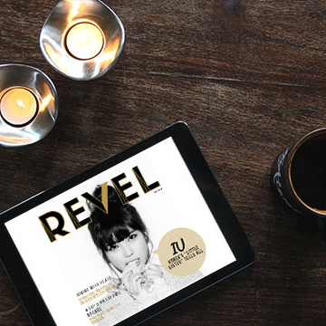
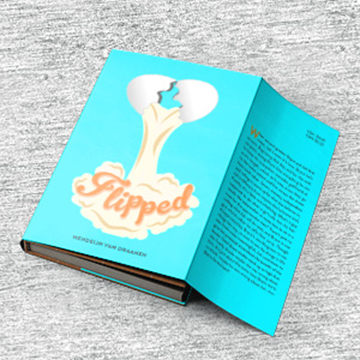

<!DOCTYPE HTML>
<html>
<head>
	<meta charset="UTF-8">
	<title>Janine Sato | Design | Portfolio</title>

	<!--fonts-->
	<link href="http://fonts.googleapis.com/css?family=Lato" rel="stylesheet" type="text/css"/>
	<link href="http://fonts.googleapis.com/css?family=Kalam:400,700" rel="stylesheet" type="text/css">

	<!--stylesheet-->
    <link href="portfolio.css" style type ="text/css" rel="stylesheet">

    <!--jQuery 2.1.1 -->
    

    <!--jQuery --> 
    
    
    

    <!--favicon-->
    <link rel="shortcut icon" href="favicon.ico" type="image/x-icon">
	<link rel="icon" href="favicon.ico" type="image/x-icon">

</head>
<body>

 <!--contains all the content-->
	
 <!--includes logo and nav-->
		
  <!-- start of logo  -->
			
		
 <!--end of logo  -->
    
    	<nav class="nav"> <!--start of nav-->
		    <ul>
			    <li><a href="#about">ABOUT</a></li>
				<li><a href="#work">WORK</a></li>
				<li><a href="#resume">R&Eacute;SUM&Eacute;</a></li>
				<li><a href="#contact">CONTACT</a></li>
		    </ul><!--end of nav-->
		</nav> <!--end of logo with link back to index-->
	
 <!--end of header (inlcudes logo and nav)-->

<section id="home"> <!--home section-->
	

		
Hello!

		<h1>
			My name is Janine. <strong>I</strong> like to <strong>Design.</strong> Especially <strong>for<em> YOU.</em></strong>
		</h1>
			

	

	

	<a href="#about">
		<!-- 

 -->
	<svg class="bounce" version="1.1" xmlns="http://www.w3.org/2000/svg" xmlns:xlink="http://www.w3.org/1999/xlink" x="0px" y="0px"
	 width="182.769px" height="168.6px" viewBox="0 0 182.769 168.6" enable-background="new 0 0 182.769 168.6" xml:space="preserve">
	<g id="Layer_1">
		<polygon fill="#C93539" stroke="#000000" stroke-width="3" points="130.279,82.895 147.689,5.798 38.447,5.798 52.338,82.894 
			19.384,82.895 90.662,163.6 163.384,82.895 	"/>
		<g>
			<path stroke="#000000" stroke-miterlimit="10" d="M73.762,104.535c1.088,0,1.97-1.914,1.97-4.276c0-2.359-0.882-4.274-1.97-4.274
				c-1.087,0-1.971,1.915-1.971,4.274C71.791,102.622,72.675,104.535,73.762,104.535"/>
			<ellipse stroke="#000000" stroke-width="3" cx="73.762" cy="100.26" rx="1.97" ry="4.275"/>
			<path stroke="#000000" stroke-miterlimit="10" d="M109.036,104.535c1.088,0,1.97-1.914,1.97-4.276c0-2.359-0.882-4.274-1.97-4.274
				c-1.089,0-1.971,1.915-1.971,4.274C107.065,102.622,107.947,104.535,109.036,104.535"/>
			<ellipse stroke="#000000" stroke-width="3" cx="109.036" cy="100.26" rx="1.97" ry="4.275"/>
			<path fill="none" stroke="#000000" class="smile" stroke-width="3" d="M83.457,112.646c2.743,5.926,11.731,6.259,15.856,0"/>
		</g>
	</g>
	<g id="Layer_2">
	</g>
	</svg>
	</a>
	

</section><!--end of home section-->

<section id="about"><!--about section-->
	

		<h2> A LITTLE BIT ABOUT ME...</h2>
			

				

				
Hello there! My name is Janine Sato and I am a Bay Area designer who is passionate, excited, and committed to helping you create your next project! I have a deep passion for print, design, and packaging. I want to be able to make beautiful things come to life and to inspire others through my work. I am a goofy person with a love of cute simplicity. I love to cartoon and make people smile through my work. I also enjoy the beauty of minimalist design that speaks through simplicity.  I hope that I can help you achieve your design aesthetic and make your vision a reality! 

				

				
			

				

			       
			    

	

</section><!--end of about section-->

<section id="work"><!--work section-->
	

		<h2> WORK</h2>
		

        			<figure class="effect-ming">
	            	
		            <figcaption>
		                <h3>Revel&nbsp;Magazine</h3>
		                
PRINT & DIGITAL

		                <a href="revel.html">View more</a>
		            </figcaption>           
                    </figure>
                    <figure class="effect-ming">
	            	
		            <figcaption>
		                <h3>Animal&nbsp;Farm&nbsp;Book</h3>
		                
PRINT

		                <a href="book.html">View more</a>
		            </figcaption>           
                    </figure>
                    <figure class="effect-ming">
                        
                        <figcaption>
                            <h3>Eskimoo&nbsp;Website</h3>
                            
DIGITAL

                            <a href="website.html">View more</a>
                        </figcaption>           
                    </figure>
                    <figure class="effect-ming">
                        
                        <figcaption>
                            <h3>Brave&nbsp;Stickers</h3>
                            
PRINT

                            <a href="stickers.html">View more</a>
                        </figcaption>           
                    </figure>
                    <figure class="effect-ming">
                        
                        <figcaption>
                            <h3>Oasis&nbsp;Menus</h3>
                            
PRINT

                            <a href="menus.html">View more</a>
                        </figcaption>           
                    </figure>
                    <figure class="effect-ming">
                        
                        <figcaption>
                            <h3>Lion&nbsp;Sweatshirts</h3>
                            
PRINT

                            <a href="sweatshirt.html">View more</a>
                        </figcaption>           
                    </figure>
                    <figure class="effect-ming">
	            	
		            <figcaption>
		                <h3>Flipped&nbsp;Book&nbsp;Jacket</h3>
		                
PRINT

		                <a href="bookjacket.html">View more</a>
		            </figcaption>
		            </figure>
                    <figure class="effect-ming">
                        
                        <figcaption>
                            <h3>CPE&nbsp;Flyer</h3>
                            
PRINT & DIGITAL

                            <a href="cpe.html">View more</a>
                        </figcaption> 
                     </figure>
                     <figure class="effect-ming">
                        
                        <figcaption>
                            <h3>Cal&nbsp;Poly&nbsp;Tailgate In&nbsp;A&nbsp;Box</h3>
                            
PRINT

                            <a href="box.html">View more</a>
                        </figcaption>         
                    </figure>
                

    

</section><!--end of work section-->

<section id="resume"><!--resume section-->
	

		<h2> R&Eacute;SUM&Eacute;</h2>
			

				

					

						<h4>Education</h4>
					

					
	
						
California Polytechnic State University, San Luis Obispo
							 
							Bachelor of Science, Graphic Communication
							 
							Dual Concentrations: Design Reproduction Technology and  Graphics for Packaging
							 
							Minor: Packaging
							 
							Conferred: June 2015
							 
							
						

					
					

					

						

							<h4>Experience</h4>
						

						

							
Production Designer, Apple Inc. (Contracted through Welocalize) August 2014 &#8212; Present

							
							<ul>
								<li>Produced localized printed and digital documentation for various Apple products across 40 different languages</li>
							</ul>
							
Specialty Printing Manager, University Graphic Systems June 2014 &#8212; June 2015

							<ul>
								<li>Printed projects using screen printing</li>
								<li>Utilized the i-Cut to produce various products : ie. packaging; labels, etc.</li>
								<li>Created mugs through the process of dye sublimation</li>
								<li>Printed vinyl banners for clients and on-campus entities</li>
								<li>Ran a complete retail printing center that provides quick print services</li>
							</ul>

							
Research Assistant, Xiaoying Rong April 2015 &#8212; June 2015

							<ul>
								<li>Assisted with research for pad printing</li>
								<li>Imaged and washed out plates used for pad printing</li>
							</ul>

							
Freelance Designer, Computer Engineering Department March 2014 &#8212; May 2015

							<ul>
								<li>Designed and created fliers for electronic and mail distribution</li>
								<li>Helped to redesign the department website</li>
								<li>Created vinyl banners that were used at an Open House event</li>
							</ul>

							
Research Assistant, Malcom Keif March 2014 &#8212; February 2015

							<ul>
								<li>Assisted with extensive research for printed electronics projects</li>
							</ul>

							
Freelance Designer, Oasis Restaurant Summer 2013

							<ul>
								<li>Created business cards and menus for the restaurant</li>
							</ul>

							
Marketing Intern, University Graphic Systems  April 2013 &#8212; June 2013

							<ul>
								<li>Built a marketing campaign for Oasis restaurant in San Luis Obispo</li>
								<li>Designed advertisement posters </li>
							</ul>
						

					

					

						

							<h4>Digtial Skills</h4>
						

						

							

								

									<ul>
										<li>Adobe Photoshop</li>
										<li>Adobe Illustrator</li>
										<li>Adobe InDesign</li>
									</ul>
								

								

									<ul>
										<li>Microsoft Word</li>
										<li>Microsoft PowerPoint</li>
										<li>Microsoft Excel</li>
									</ul>
								

								

									<ul>
										<li>HTML</li>
										<li>CSS</li>
										<li>Sublime Text</li>
									</ul>
								

							

						

						

							

								<h4>Honors &amp; Awards</h4>
							

							

								
Summa Cum Laude &#8212; Awarded: June 2015

								
President’s List &#8212; Awarded: Summer 2012-Spring 2015

								<ul>
									<li>Awarded at the end of each university year to those undergraduate students who have demonstrated consistent achievement, as represented by being named on the Dean’s Honors List for any three of the four quarters of the university year
									</li>
								</ul>
								
Senior of the Year &#8212; Awarded: June 2015

								<ul>
									<li>Awarded to the most dedicated and hard-working member of the Graphic Communication community, as voted by the faculty of the Graphic Communication Department
									</li>
								</ul>
								
Senior of the Year &#8212; Awarded: June 2015

								<ul>
									<li>Awarded to the most dedicated and hard-working member of the Graphic Communication community, as voted by the faculty of the Graphic Communication Department
									</li>
								</ul> 
								
Publishing Professionals Network Judges’ Choice Certificate &#8212; Awarded: May 2015

								<ul>
									<li>Recognized for excellence in the design and production of Animal Farm by George Orwell
									</li>
								</ul>
								
Robert E. Kennedy Library Special Collections &#8212; Added: July 2015

								<ul>
									<li>Self designed and produced edition of Animal Farm was purchased by Robert E. Kennedy Library Special Collections
									</li>
								</ul>
							

						

					

				

			

		

		

			<a href="images/Resume Updated Sept. 2015.pdf">download pdf </a>
		

</section><!--end of resume section-->

<section id="contact"><!--contact section-->

	

		

		<form action="MAILTO:janineksato@gmail.com" method="post" enctype="text/plain">
		<h3> GET IN TOUCH WITH ME </h3>
		<h4>Fill in the form below, and I'll get back to you as soon as I can. </h4>      
		  <input name="name" type="text" class="feedback-input" placeholder="Name" />   
		  <input name="email" type="text" class="feedback-input" placeholder="Email" />
		  <textarea name="text" class="feedback-input" placeholder="Message"></textarea>
		  <input type="submit" value="SUBMIT"/>
		</form>	
	
<!--End of content-contactform-->
	

</section>

</body>
